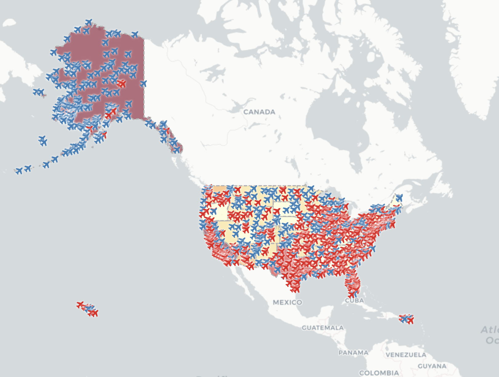
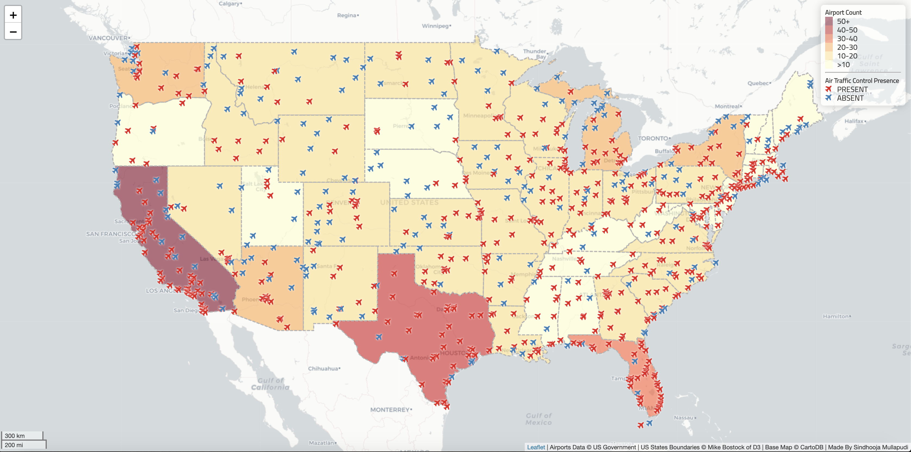
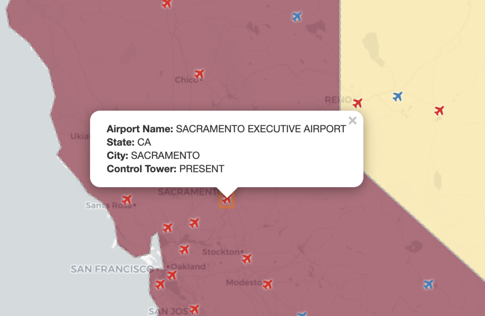
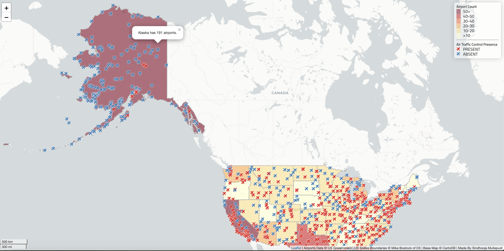

# United States Airport Interactive Web Map
## Sindhooja Mullapudi

**Introduction**
>This is an interactive web map featuring all the airports in the United States as of 2012. All airports are marked with an airplane icon on the map based on their location. The icons that are red represent the airport has an air traffic control tower, and the red icons are the airports with no control tower. The basemap is presenting numbers of airports in each states with quantitative color map. The lighter the state, the fewer the airports; the darker the state, the more the number or airports. For more information on the other elements of the map, refer below. 

>**Below is a screenshot of the full map**

**Primary Functions**
****_Overall Information_****
>When the airplane markers are clicked, you can see a popup of the overall information about that particular airport, like below. 

 
****_Airport Count Per State_****
>When the states are clicked, you can see the total airport count in that state, like below. 

**Libraries Used**
>https://cdnjs.cloudflare.com/ajax/libs/leaflet-ajax/2.1.0/leaflet.ajax.min.js
>https://ajax.googleapis.com/ajax/libs/jquery/3.1.0/jquery.min.js
>https://unpkg.com/leaflet@1.3.1/dist/leaflet.css
>https://unpkg.com/leaflet@1.4.0/dist/leaflet.js
>https://cdnjs.cloudflare.com/ajax/libs/font-awesome/4.7.0/css/font-awesome.css
>https://fonts.googleapis.com/css?family=Titillium+Web
>https://cdnjs.cloudflare.com/ajax/libs/chroma-js/1.3.4/chroma.min.js

**Data Sources**
>airports.geojson _This data is converted from a shapefile_ has information about all the airports in the United States. 
[Data.gov](https://catalog.data.gov/dataset/usgs-small-scale-dataset-airports-of-the-united-states-201207-shapefile).
>us-states.geojson _This data is acquired from [Mike Bostock](https://bost.ocks.org/mike/) of [D3](https://d3js.org/)._ A geojson data file containing all the states' boundaries of the United States.

**Credit**
>attribution: 'Airports Data &copy; US Government | US States Boundaries &copy; Mike Bostock of D3 | Base Map &copy; CartoDB | Made By Sindhooja Mullapudi'

**Acknowledgment**
>Professor Bo Zhao|Geog 458|University of Washington
>Leaflet
>ajax.googlepis.com
>font-awesome
>Google
